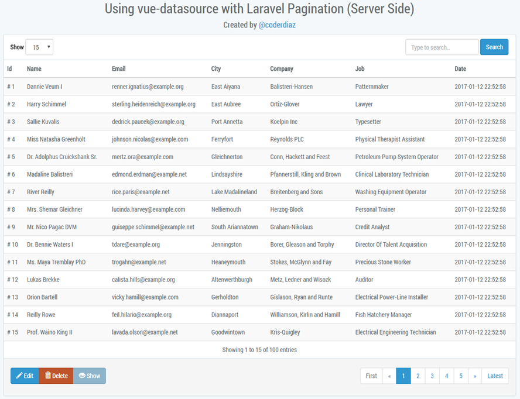

<p align="center">
    <a href="https://github.com/coderdiaz/vue-datasource">
        
    </a>
    <h2 align="center">Vue Datasource</h2>
</p>

<p align="center">
    A Vue.js component to create dynamic tables. Compatible with Vue 2.x and Laravel.
</p>

<p align="center">
    <a href="https://npmjs.com/package/vue-datasource"></a>
    <a href="https://github.com/coderdiaz/vue-datasource/blob/master/LICENSE"></a>
    <a href="https://github.com/coderdiaz/vue-datasource/stargazers"></a>
    <a href="http://npmjs.com/package/vue-datasource"></a>
    <a href="http://npmjs.com/package/vue-datasource"></a>
    <a href="https://www.paypal.me/coderdiaz"></a>
  <a href="https://beerpay.io/coderdiaz/vue-datasource"></a>
</p>

---

### Demo
<p align="center">
    
</p>

## Support on Beerpay
Hey dude! Help me out for a couple of :beers:!

[](https://beerpay.io/coderdiaz/vue-datasource)  [](https://beerpay.io/coderdiaz/vue-datasource?focus=wish)

### Install/Usage
For use this package is necessary install [babel-plugin-transform-vue-jsx](https://github.com/vuejs/babel-plugin-transform-vue-jsx) dependency.

```
$ npm install vue-datasource
```

```html
<div id="#app">
    <server-datasource
        :source="items"
        :total="total_of_items"
        :columns="columns"
        :actions="actions"></server-datasource>
</div>
```

```javascript
import { ServerDatasource } from 'vue-datasource'

new Vue({
    el: '#app',
    components: {
        ServerDatasource
    },
    data() {
        return {
            items: [...],
            total: 100,
            columns: [...],
            actions: [...]
        }
    }
});
```

## Documentation

### Available Props
| Prop        | Type    | Default        | Description                                                                        |
|-------------|---------|----------------|------------------------------------------------------------------------------------|
| source      | Array   |                | Items to show in table                                                             |
| total       | Number  |                | Total of items
| translation | Object  | [Object]       | Defines the table labels language ([structure](#translation-structure))            |
| limits      | Array   | [1,5,10,15,20] | Defines the limits to display                                                      |
| columns     | Array   |                | Columns to display                                                                 |
| actions     | Array   |                | Action buttons ([structure](#action-event-sctructure))                             |

### Available Events
| Event       | Description                                                                                         |
|-------------|-----------------------------------------------------------------------------------------------------|
| change      | Handle show limit changed. Gets object with new show limit and current page `{perpage: 10, page: 2}`|
| searching   | Handles search input. Gets string as parameter                                                      |
| column-sort | Only if `order` is defined in column array. Return the current column sorted with metadata ([Sort Column](#sort-column))

### Columns
Each column object needs `name` and `key` attributes.
```javascript
{
    ...,
    columns: [
        {
            name: 'Name', // Table column name to display
            key: 'name', // Key name from row object
        }
    ]
}
```

Laravel users can access relationships through the `key` attribute. Lets say we have the following object in our users array:

```javascript
[
    ...,
    {
        name: 'Foo',
        last_name: 'Bar'
        role_id: 1,
        role: {
            name: 'admin'
        }
    }
]
```

To get the user role we would need to define in our columns array:
```javascript
{
    ...,
    columns: [
        {
            name: 'Role',
            key: 'role.name'
        }
    ]
}
```

### Sort column
**[New]** You only need a `order` property in column defined for use this feature.
```javascript
{
    ...,
    columns: [
        {
            name: 'Name',
            key: 'name',
            order: true
        }
    ]
}
```

This feature emit a event `column-sort` with this data object
```javascript 
{
    sort: {
        key: 'name',
        order: false
    },
    type: 'DESC'
}
```

### Render column
This callback will modify the data for various operations. Such as applying a specific format or an arithmetic operation to the column value and return it.

```javascript
{
    ...,
    columns: [
        {
            name: 'Name',
            key: 'name',
            render(value) { // Render callback
                return `Enginner ${value}`;
            }
        }
    ]
}
```

**[New]** Now you can use JSX for render other templates and too use the row data.

```javascript
{
    ...,
    columns: [
        {
            name: 'Name',
            key: 'key',
            render (value, row) {
                return <strong>{value}</strong>
            }
        }
    ]
}
```

### Translation Structure
```javascript
{
    limit: 'Limit',
    search: 'Search',
    placeholder_search: 'Type to search..',
    records_not_found: 'No records found',
    pagination: {
        show: 'Showing',
        to: 'to',
        of: 'of',
        entries: 'entries'
    }
}
```

### Action Event Sctructure
```javascript
{
    ...,
    actions: [
        {
            text: 'Click me', // Button label
            icon: 'glyphicon glyphicon-check', // Button icon
            class: 'btn-primary', // Button class (background color)
            show(selectedRow) { // Event to define a condition to display the button with the selected row
                return true
            },
            event(e, row) { // Event handler callback. Gets event instace and selected row
                console.log('Click row: ', row); // If no row is selected, row will be NULL
            }
        }
    ]
}
```

### Development

``` bash
# install dependencies
npm install

# serve with hot reload at localhost:8080
npm run dev

# build for production with minification
npm run build

# build for production and view the bundle analyzer report
npm run build --report

# run unit tests
npm run unit

# run e2e tests
npm run e2e

# run all tests
npm test
```

For detailed explanation on how things work, checkout the [guide](http://vuejs-templates.github.io/webpack/) and [docs for vue-loader](http://vuejs.github.io/vue-loader).

### Implementation examples
- Using Laravel 5.3 and pagination: [laravel-datasource-example](https://github.com/coderdiaz/laravel-datasource-example).

### Contributions
All contributions are welcome send your PR and Issues.

### License
This is a open-source software licensed under the [MIT license](https://raw.githubusercontent.com/coderdiaz/vue-datasource/master/LICENSE)

##### Crafted by Javier Diaz. Translation by [itsuwaribito](https://github.com/itsuwaribito)
